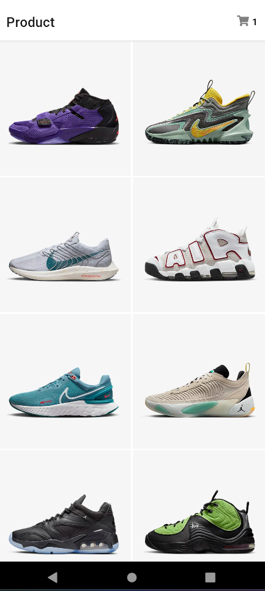
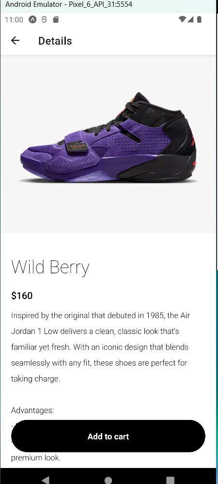
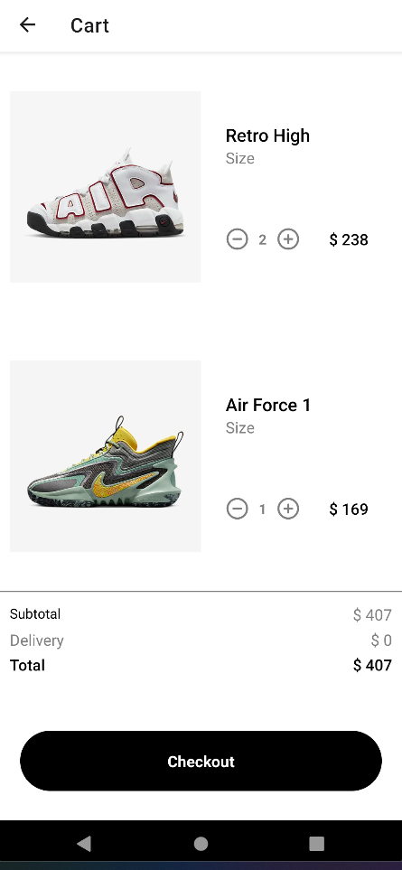

# nike-clone-app

## Introduction

This repository contains a clone of the Nike App, developed using React Native, JavaScript, and Redux with Expo. The purpose of this project is to demonstrate the process of developing a mobile application using these technologies and leveraging the features provided by Expo.

## Features

- Browse and explore a wide range of Nike products
- View detailed product information, including images, descriptions, and pricing
- Add products to the shopping cart
- Manage the shopping cart and proceed to checkout
- User authentication and account creation
- Order history and tracking

## Prerequisites

Before running the application, ensure you have the following software installed on your machine:

- Node.js
- npm
- Expo CLI

## Getting Started

- Clone the repository: git clone https://github.com/arthurchina92/nike-clone-app.git
- Install the project dependencies: npm install
- Start the development server: expo start
- Connect your mobile device or use an emulator
- Run the app on your device/emulator by following the instructions provided by the Expo CLI.

## Resources

- React Native Documentation
- Expo Documentation
- Redux Documentation

## Contributing

Contributions to this project are welcome! If you encounter any issues or have suggestions for improvements, please submit an issue or create a pull request.

## License

- This project is licensed under the MIT License.
- Feel free to reach out if you have any further questions or need assistance with the Nike App clone developed with Expo. Happy coding!

## Screenshots
### Product Screen
||
### Product Details Screen
||
### Shopping Cart Screen
||

